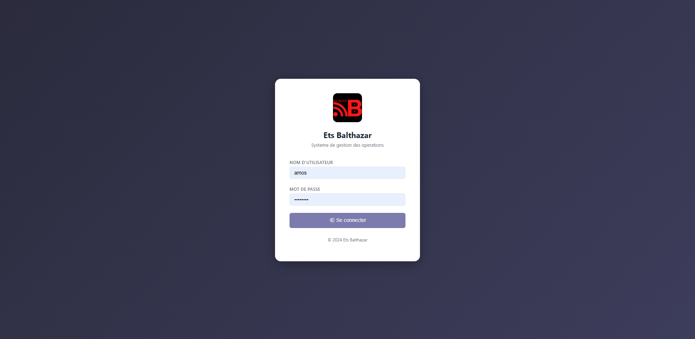
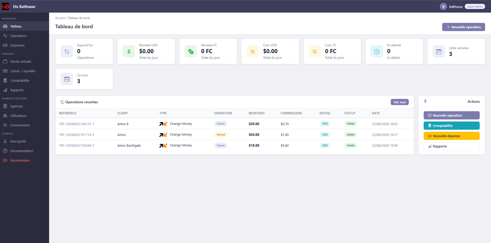

# Ets Balthazar - Gestion de transferts d'argent

Application web de gestion des transferts d'argent pour les agences.
Permet d'enregistrer les operations de depot/retrait (Orange Money, Airtel Money, M-Pesa),
de gerer les depenses, la comptabilite, et de generer des rapports.

## Fonctionnalites

- **Operations** - Creation, validation et suivi des transferts
- **Stocks virtuels** - Suivi des stocks par type d'operation et par devise, par agence et par guichetier
- **Caisse / Liquidite** - Solde de caisse par devise, par agence et par guichetier
- **Depenses** - Enregistrement et approbation
- **Comptabilite** - Ecritures automatiques, soldes par devise
- **Rapports** - Statistiques par periode et agence
- **Agences** - Gestion multi-agence
- **Utilisateurs** - 5 roles avec permissions distinctes
- **Commissions** - Configuration des baremes (pourcentage + fixe)

## Roles et permissions

| Role | Permissions |
|------|-------------|
| **Super Admin** | Acces total a toutes les agences |
| **Admin Agence** | Gere son agence : utilisateurs, stocks, caisse, operations, depenses |
| **Secretaire** | Gere les utilisateurs et consulte les donnees de l'agence |
| **Comptable** | Consulte et rapports, validation des depenses |
| **Guichetier** | Cree et suit ses propres operations, consulte ses stocks/caisse (lecture seule) |

## Stocks et Caisse

- **Stocks virtuels** par type d'operation (Orange Money, Airtel Money, M-Pesa) et par devise (USD, FC)
- **Caisse** par devise (USD, FC)
- Les stocks et caisses sont suivis **par agence** et **par guichetier**
- Mis a jour automatiquement a la validation d'une operation :
  - Depot : +stock, -caisse
  - Retrait : -stock, +caisse
- **Super Admin / Admin Agence** : peuvent configurer les soldes d'ouverture pour chaque guichetier
  - Sur la page de creation/modification d'un utilisateur guichetier
  - Ou directement sur les pages Stocks / Caisse
- **Guichetier** : voit ses propres soldes en lecture seule

## Technologies

- Python / Flask
- SQLite / SQLAlchemy
- Bootstrap 5
- CSS personnalise (style Odoo-like)

## Installation (local)

```bash
git clone https://github.com/mud-mos23/agencyBalth.git
cd agencyBalth
pip install -r requirements.txt
python app.py
```

Acces : http://localhost:5000

## Deploiement sur cPanel (sous-domaine)

1. **Dans cPanel > Domains** : creez un sous-domaine (ex: `app.votresite.com`) et pointez-le vers le dossier de l'application.

2. **Dans cPanel > Setup Python App** :
   - Python version : 3.8 ou superieur
   - Application root : le dossier du sous-domaine
   - Application URL : votre sous-domaine
   - Application startup file : `passenger_wsgi.py`
   - Application Entry point : `application`

3. **Uploader les fichiers** via Git ou FTP dans le dossier du sous-domaine.

4. **Installer les dependances** : cPanel le fera automatiquement, ou lancez :
   ```bash
   pip install -r requirements.txt
   ```

5. **Securite** : Modifiez la `SECRET_KEY` dans l'application ou definissez la variable d'environnement.

6. **Base de donnees** : Le fichier SQLite (`agence.db`) sera cree automatiquement au premier demarrage.

> **Note** : Pour un environnement de production, configurez une variable d'environnement `SECRET_KEY` dans cPanel (Setup Python App > Environment variables).

## Comptes par defaut

| Role | Identifiant | Mot de passe |
|------|-------------|--------------|
| Super Admin | admin | admin123 |
| Admin Agence | admin_agence | admin123 |
| Comptable | comptable | comptable123 |
| Guichetier | guichetier | guichetier123 |
| Secretaire | secretaire | secretaire123 |

## Captures d'ecran


*Page de connexion*


*Tableau de bord apres connexion*

## Documentation

Une documentation detaillee par poste est accessible dans l'application
via le menu **Compte > Documentation**.
